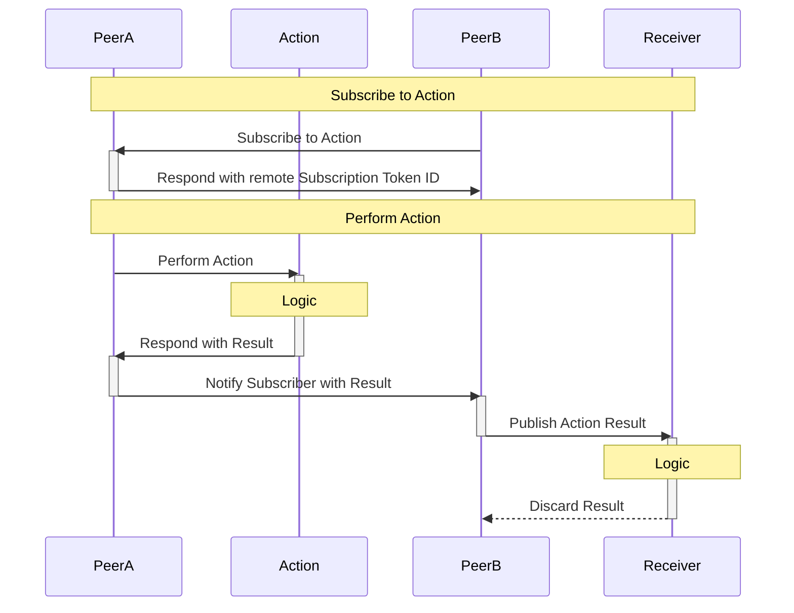

# Coattail

Coattail is a secure [peer-to-peer](https://en.wikipedia.org/wiki/Peer-to-peer) remote execution and queueless* [pub/sub](https://en.wikipedia.org/wiki/Publish%E2%80%93subscribe_pattern) service.

It's intention is to allow users to subscribe to the results of actions being performed on peered instances of Coattail and subsequently perform their own action based on the publication from the peer.

### General Use Case Sequence Diagram

_* Coattail does not make use of a queue when publishing events to subscribers._