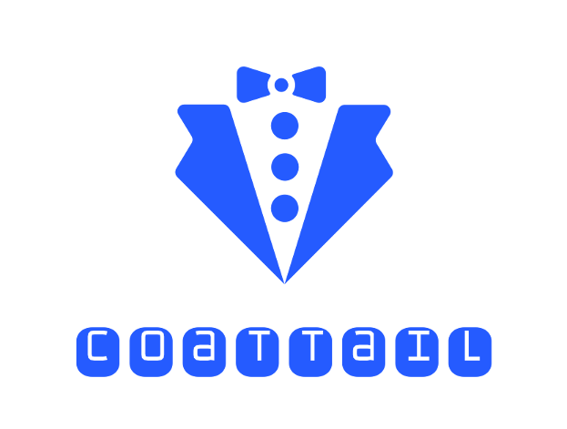
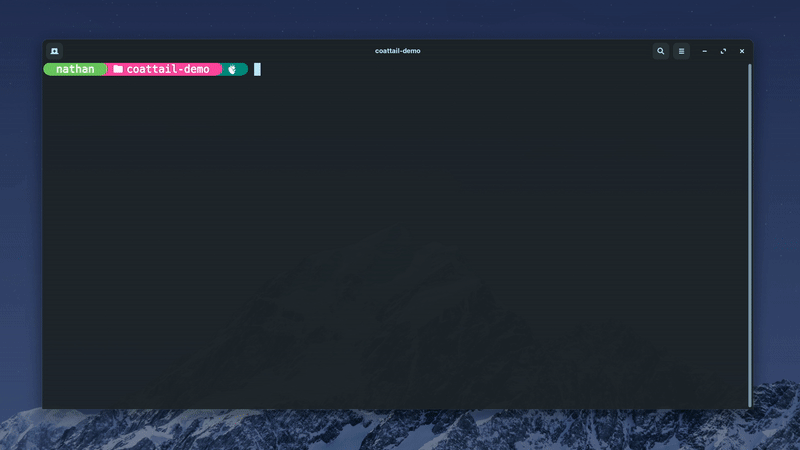
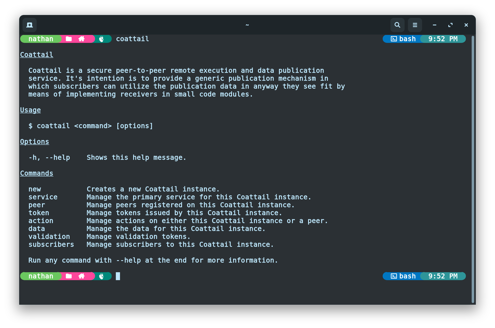

<p align="center">
    
</p>

# Coattail

Coattail is a secure [peer-to-peer](https://en.wikipedia.org/wiki/Peer-to-peer) remote execution and data publication service. It's intention is to provide a generic publication mechanism in which subscribers can utilize the publication data in anyway they see fit by means of implementing receivers in small code modules.



# Index

- [Features](#features)
- [Installing Coattail](#installing-coattail)
- [Getting started](#getting-started)
  - [Initializing a Coattail Instance](#initializing-a-coattail-instance)
  - [Running Database Migrations](#running-database-migrations)
  - [Managing your Coattail Service](#managing-your-coattail-service)
- [Configuring TLS for your Coattail Instance](#configuring-tls-for-your-coattail-instance)
  - [Generating Certificate & Key](#generating-certificate--key)
  - [Applying Certificate & Key](#applying-certificate--key)

# Features

|Feature|Documentation|
|---|---|
|Peer-to-peer architecture providing a decentralized base for communication.|[Coattail Architecture](./docs/architecture.md)|
|Easy to use data manipulation, publication and subscription.|[Subscriptions](./docs/architecture.md)|
|Modern command line interface for managing instances.|[CLI Usage](./docs/cli.md)|
|Secure permission driven remote execution on peered instances.|[Tokens](./docs/tokens.md)|
|Subscription based publication chaining.|[Publishing](./docs/publishing.md)|
|Support for secure signature based packet source verification.|[Validation Tokens](./docs/vts.md)|
|Support for TLS providing a secure tunnel with end-to-end encryption for data transport.|[TLS](./docs/tls.md)|

# Installing Coattail

Coattail is primarily a command-line application. You can install Coattail via the [Node Package Manager](https://docs.npmjs.com/downloading-and-installing-node-js-and-npm). Provided you have the Node Pakcage Manager installed, you can run the following command to install Coattail.

```sh
$ npm i -g coattail
```

Once completed, the Coattail command will be available globally on your system. You can verify that the installation was successful by attempting to run the `coattail` command. You should see the following output.



# Getting started

This quick guide will walk you through creating your first Coattail instance and initializing it for first time use. It includes creating the Coattail instance, running it's database Migrations and starting it's core service.

## Initializing a Coattail Instance

> You will need an empty directory in which to store your Coattail Instances files.

```sh
$ mkdir my-coattail-instance
$ coattail new ./my-coattail-instance
```

You should now have the following file structure in your Coattail Instance directory.

```yaml
my-coattail-instance/
├── actions            # Actions that this instance can perform.
├── receivers          # Receivers for incoming publications.
├── keys               # Cryptographic keys
│   ├── auth-key.pem   # Authentication private key.
│   ├── auth-key.pub   # Authentication public key.
│   ├── vt-key.pem     # Validation private key.
│   └── vt-key.pub     # Validation public key.
├── data.db            # Local data storage.
├── package.json       # The npm package file for the Coattail instance.
├── config.yml         # Instance configuration.
└── service.log        # Your service log file.
```

## Running Database Migrations

Once you have created the Coattail Instance, you will need to run Database Migrations to set up the Coattail Instances database for first time use. This database is used to store information about registered peers, issued tokens, subscriptions and other types of persistent data used by the Coattail instance.

To run the database migrations, navigate to your Coattail Instance and run the following command.

```sh
$ coattail data migrate latest
```

## Managing your Coattail service

Your Coattail Instance will need to be running in order to communicate with peering Coattail instances. You should ideally run your Coattail Instance in headless mode to keep it running in the background. To start your coattail instance, navigate to your Coattail instance and run the following command.

```sh
$ coattail service start --headless
```

You can check the status of your Coattail instance (along with any other Coattail instance running on the system) by navigating to any Coattail instance and running the following command.

```sh
$ coattail service status
```

You can stop a Coattail instance by determining the PID for the service using (this is listed in the output of the `status` command above) and passing it to the following command.

```sh
$ coattail service stop <pid>
```

## Configuring TLS for your Coattail Instance

By default Coattail runs over plain TCP/IP. Coattial is most secure when running over TCP/IP with TLS. You can enable TLS in your instances `config.yml` file.

> See the [Configuration](#configuration) section for more information on Configuring other options in your Coattail instances `config.yml` file.
### Generating Certificate & Key

Before you can enable TLS, you will need to generate a Certificate and Key. You can generate the certificate and key by executing the commands below.

It is important that when generating your certificate you provide the **Issuer Hash** from your Coattail instance for theh "Common Name" (_CN_).

```sh
# Retrieve the issuer hash
# This will be used for the CN value in your certificate
$ coattail token issuer

# Generate the key
$ openssl genrsa -out server-key.pem 1024

# Generate a CSR for the certificate
# Make sure to use the issuer hash for the Common Name (CN)
$ openssl req -new -key server-key.pem -out server-csr.pem

# Generate the certificate
$ openssl x509 -req -in server-csr.pem -signkey server-key.pem -out server-cert.pem

# Remove the CSR as we no longer need it.
$ rm server-csr.pem
```

### Applying Certificate & Key

Once you have the keys, you will need to open your instances `config.yml` file and configure the `service.tls` section as written below. Be sure to use the absolute paths to your certificate and key files.

```yml
service:
  tls:
    enabled: true
    key: '/absolute/path/to/server-key.pem'
    cert: '/absolute/path/to/server-cert.pem'
```

Once it has been configured, make sure that you restart your Coattail Instances service if it is already running.

> Any tokens issued before you modify the service section of your configuration will cease to function with your Coattail instance. It's recommended that you configure your instance before issuing any tokens.
