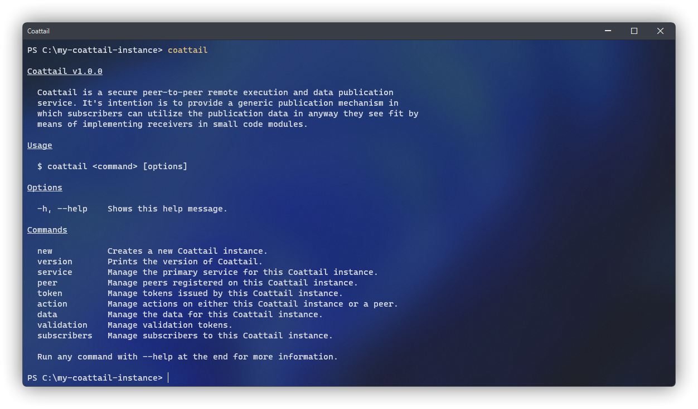
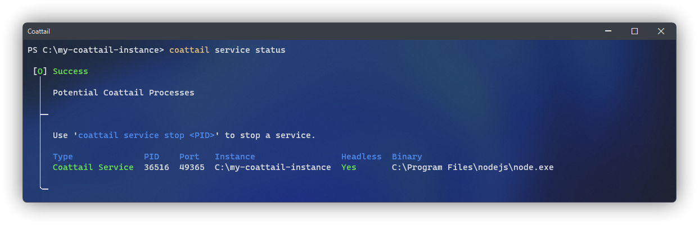
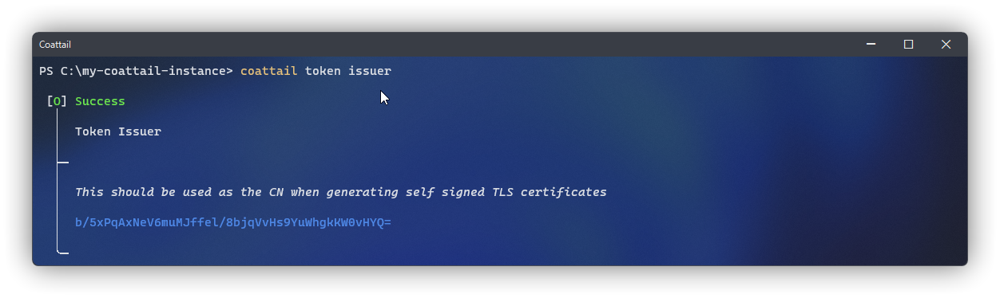
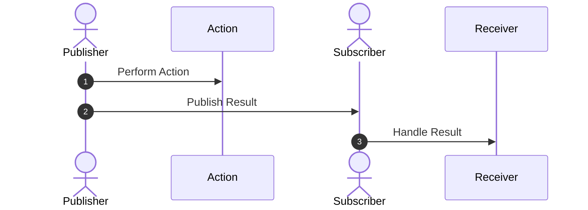
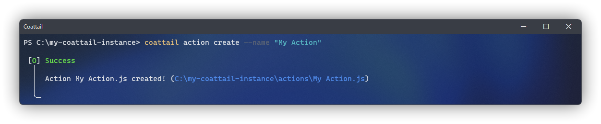
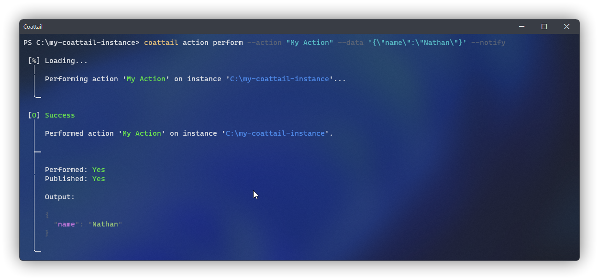
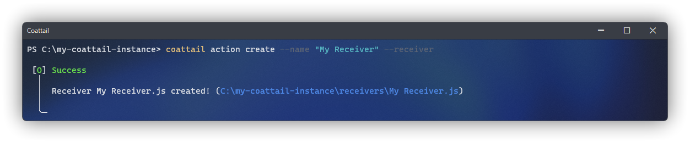

<p align="center">
    
</p>

# Coattail

Coattail is a secure [peer-to-peer](https://en.wikipedia.org/wiki/Peer-to-peer) remote execution and data publication service. It's intention is to provide a generic publication mechanism in which subscribers can utilize the publication data in anyway they see fit.


# Features

|Feature|Documentation|
|---|---|
|Peer-to-peer architecture providing a decentralized base for communication.|[Architecture](./docs/architecture.md)|
|Easy to use data manipulation, publication and subscription.|[Subscriptions](./docs/subscription.md)|
|Subscription based publication mechanism.|[Actions & Receivers](#managing-actions--receivers)|
|Support for secure signature based packet source verification.|[Authentication](#authentication)|
|Modern command line interface for managing instances.|[CLI Usage](./docs/cli.md)|
|Secure permission driven remote execution on peered instances.|[Tokens](#authentication)|
|Support for TLS providing a secure tunnel with end-to-end encryption for data transport.|[TLS](#configuring-tls-for-your-coattail-service)|

# Index

- [Installing Coattail](#installing-coattail)
- [Getting started](#getting-started)
  - [Initializing a Coattail Instance](#initializing-a-coattail-instance)
  - [Managing your Coattail Service](#managing-your-coattail-service)
- [Configuring TLS for your Coattail Service](#configuring-tls-for-your-coattail-service)
  - [Generating Certificate & Key](#generating-certificate--key)
  - [Applying Certificate & Key](#applying-certificate--key)
- [Managing Actions & Receivers](#managing-actions--receivers)
  - [Actions](#actions)
  - [Receivers](#receivers)
- [Authentication](#authentication)
  - [Configuring Authentication](#configuring-authentication)
  - [Token Issuance](#token-issuance)
  - [Token Revocation](#token-revocation)
  - [Validation Tokens](#validation-tokens)

# Installing Coattail

Coattail is primarily a command-line application. You can install Coattail via the [Node Package Manager](https://docs.npmjs.com/downloading-and-installing-node-js-and-npm). I would highly recommend you install NPM using [`nvm`](https://github.com/nvm-sh/nvm) instead of the official distribution. Provided you have NPM installed, you can run the following command to install Coattail.

```ps
$ npm i -g coattail
```

Once completed, the Coattail command will be available globally on your system. You can verify that the installation was successful by attempting to run the `coattail` command. You should see the following output. If you do not see the expected output, verify that your Node installations `bin` directory is added to your path. See [here](https://docs.npmjs.com/cli/v8/configuring-npm/folders#executables) for more information.



# Getting started

This quick guide will walk you through creating your first Coattail instance and initializing it for first time use. It includes creating the Coattail instance, running it's database Migrations and starting it's core service.

## Initializing a Coattail Instance

> You will need an empty directory in which to store your Coattail Instances files.

```ps
$ mkdir "my-coattail-instance" ; cd "my-coattail-instance"
$ coattail new "./"
```

You should now have the following file structure in your Coattail Instance directory.

```yaml
my-coattail-instance/
├── actions            # Actions that can be performed with this instance.
│   └── <empty>
├── receivers          # Receivers for incoming publications.
│   └── <empty>
├── keys               # Cryptographic keys
│   ├── auth-key.pem   # Authentication private key.
│   ├── auth-key.pub   # Authentication public key.
│   ├── vt-key.pem     # Validation private key.
│   └── vt-key.pub     # Validation public key.
├── data.db            # Local data storage.
├── package.json       # The npm package file for the Coattail instance.
├── config.yml         # Instance configuration.
├── service.log        # Your service log file.
└── .ct.version        # Version file for Coattail CLI.
```

## Managing your Coattail service

There are several commands built into the Coattail CLI that can be used to manage the instance of Coattail running on your system. These can be used to start a service, stop a service or list running services on the system.



### Starting a Service

Your Coattail Instance will need to be running in order to communicate with peering Coattail instances. You should ideally run your Coattail Instance in headless mode to keep it running in the background. To start your coattail instance, navigate to your Coattail instance and run the following command.

```ps
$ coattail service start --headless
```

### Viewing Service Status

You can check the status of your Coattail instance (along with any other Coattail instance running on the system) by navigating to any Coattail instance and running the following command.

```ps
$ coattail service status
```

### Stopping a Service

You can stop a Coattail instance by determining the PID for the service (this is listed in the output of the `status` command above) and passing it to the following command.

```ps
$ coattail service stop <pid>
```

# Configuring TLS for your Coattail Service

By default Coattail runs over plain TCP/IP. Coattial is most secure when running over TCP/IP with TLS. You can enable TLS in your instances `config.yml` file.
### Generating Certificate & Key

Before you can enable TLS, you will need to generate a Certificate and Key. It is important that when generating your certificate you provide the **Issuer Hash** from your Coattail instance for the "Common Name" (_CN_).



> The token issuer is based on a Base-64 encoded SHA-256 hash of your public Validation Token. As such, replacing your Validation Token will change your issuer hash. This means that if you change your Validation Token you will also need to re-generate your Certificate & Key.

Once you've retrieved the issuer hash from your Coattail instance, you can generate the certificate and key using the following commands.

```ps
# Retrieve the issuer hash
# This will be used for the CN value in your certificate
$ coattail token issuer

# Generate the key
$ openssl genrsa -out "server-key.pem" 1024

# Generate a CSR for the certificate
# Make sure to use the issuer hash for the Common Name (CN)
$ openssl req -new -key "server-key.pem" -out "server-csr.pem"

# Generate the certificate
$ openssl x509 -req -in "server-csr.pem" -signkey "server-key.pem" -out "server-cert.pem"

# Remove the CSR as we no longer need it.
$ rm "server-csr.pem"
```

> I recommend you place this key and certificate in the `keys` directory of your Coattail instance alongside the other cryptographic keys used by the instance.

### Applying Certificate & Key

Once you have the keys, you will need to open your instances `config.yml` file and configure the `service.tls` section as written below. Be sure to use the absolute paths to your certificate and key files.

```yml
service:
  tls:
    enabled: true
    key: '/absolute/path/to/server-key.pem'
    cert: '/absolute/path/to/server-cert.pem'
```

Once it has been configured, make sure that you restart your Coattail Instances service if it is already running. See [Managing your Coattail service](#managing-your-coattail-service) for more information on starting/stopping your Coattail service.

> Any tokens issued before you modify the service section of your configuration will cease to function with your Coattail instance. It's recommended that you configure your instance before issuing any tokens.

# Managing Actions & Receivers

The basic purpose of Coattail revolves around Actions and Receivers. An action is a small module of code that can be executed on the instance. Once completed, the results of this action can optionally be published to registered subscribers. When published, other Coattail instances that have subscribed to the particular Action on this instance will be notified of the resulting data. When notified, these subscriptions are processed by Receivers.



## Actions

An action is a small module of code that can be executed on the instance. Once completed, the results of this action can optionally be published to registered subscribers.

### Creating an Action

The following command will create a new action on your Coattail instance. This should be run from the root directory of your Coattail instance. Alternately, if you wish to create an action for a particular Coattail instance on your system, you can pass the absolute path of the Coattail Instance to the `--instance` flag. Once you have run this command, a new file will be created in the `actions` directory of your Coattail instance.



The default behavior for this newly created action will be to simply return whatever input it has received as it's output. You can of course customize this behavior to tailor the action to whatever you'd like it to perform. However, if you intend to allow your action to be remotely executed, it is important that you perform thorough validation of the input data.

```ps
$ coattail action create --name "My Action"
```

```js
/* ./actions/My Action.js */

module.exports = (Coattail) => class extends Coattail.Action {
    async perform(input) {
        // Perform action and return output.
        return { ...input };
    }
};
```

### Performing an Action

You can perform this action locally by running the following command. The action should simply return the input data as the output for the action.


```ps
$ coattail action perform --action "My Action" --data '{"name":"Nathan"}'
```

### Publishing Action Result

Once an action is performed, you can optionally notify any subscribers who are subscribed to this particular action. To do so, add the `--notify` flag to your `perform` command invocation.



```ps
$ coattail action perform --action "My Action" --data '{"name":"Nathan"}' --notify
```

Alternately, you can directly publish data to subscribers of an action without performing the action.

```ps
$ coattail action publish --action "My Action" --data '{"name":"Nathan"}'
```

### Listing available Actions

To list the available actions on your Coattail instance, you can use the following command:

```ps
$ coattail action list
```

## Receivers

When an action is published, other Coattail instances that have subscribed to that particular Action on this instance will be notified of the resulting data. When notified, these subscriptions are processed on the subscribing Coattail instance by Receivers.

### Creating a Receiver

The following command will create a new receiver on your Coattail instance. This should be run from the root directory of your Coattail instance. Alternately, if you wish to create a receiver for a particular Coattail instance on your system, you can pass the absolute path of the Coattail Instance to the `--instance` flag. Once you have run this command, a new file will be created in the `receivers` directory of your Coattail instance.



The default behavior for this newly created receiver will be a no-op. You should customize this behavior to appropriately handle the incoming data published by the action.

```ps
$ coattail action create --name "My Receiver" --receiver
```

```js
/* ./receivers/My Receiver.js */

module.exports = (Coattail) => class extends Coattail.Receiver {
    async onReceived(input) {
        // Handle input
    }
};
```

### Listing available Receivers

To list the available receivers on your Coattail instance, you can use the following command:

```ps
$ coattail action list --receivers
```

# Authentication

## Configuring Authentication

### Token Ownership

Tokens issued by a Coattail instance correspond directly to the `address` and `port` configured in the `config.yml` file. This means, if you change those values or use a different configuration file, tokens issued with the old values will no longer be considered valid (or even work for Bearers who are using them).

If you wish to manage tokens for a particular Coattail instance that is running, be sure to pass `--config <your_config>` to the respective token management commands.

### Token Signatures

In your `config.yml` file there is a section labeled `authentication`. In this section you should define a key-pair that will be used for signing/verifying authentication tokens.

```yml
authentication:
  private_key:
    type: "string"
    value: "my-secret-password"
  public_key:
    type: "string"
    value: "my-secret-password"
```

**`type`**

* Can be one of "string" or "file".

**`value`**
* When `type` is set to "string", `value` should be the string value of your private key.
* When `type` is set to "file", `value` should be the path to the corresponding key file, relative to the root installation directory of your Coattail instance.

> Warning: Using "string" type keys is **not** recommended for production instances of Coattail.

## Token Issuance

### Definitions

* "**Issuing Coattail Instance**": The Coattail instance that is generating a Token to be used by other Coattail instances to connect to it.
* "**Bearing Coattail Instance**": The Coattail instance that uses the issued Token to connect to the Issuing Coattail Instance.

### Basic Token Issuance

To issue a generic token you can run the following command on the _Issuing Coattail Instance_.
```sh
$ coattail token issue
```

This will issue a signed token that can be used by a _Bearing Coattail Instance_ to connect to the _Issuing Coattail Instance_. The permissions embeded in the token will allow the _Bearing Coattail Instance_ to subscribe to any action on the _Issuing Coattail Instance_, but it will not be able to remotely perform or publish actions on its behalf.

After executing the command, by default, the issued token will be stored locally in your database and the raw JWT will be copied to your clipboard. If you wish to print the token instead of copying it to the clipboard, you can use `--print-raw-token`.

> Combining the `--quiet` option with the `--print-raw-token` option allows you to get the issue command to spit out **only** the raw token. This is useful when scripting with Coattail.

### Token Bearers

You can specify _Bearing Coattail Instances_ who are authorized to use a particular token by passing a JSON serialized array to the `--bearers` parameter. When doing this, the issued token will **only** be valid if used from a _Bearing Coattail Instance_ with an IPv4 address within one of the IPv4 subnet specified in the bearers, or from a _Bearing Coattail Instance_ who has the Validation Token specified by one of the Validation Token ID's set in the Bearers array.

Each Bearer can be either a [Validation Token ID](#validation-tokens) or an IPv4 subnet.
* Bearers containing a _Validation Token ID_ should be prefixed with `vt://`. 
* Bearers containing an _IPv4 Subnet_ should be prefixed with `ipv4://` and the subnet mask should be formatted with [CIDR](https://en.wikipedia.org/wiki/Classless_Inter-Domain_Routing) notation.

**Example**
```sh
$ coattail token issue --bearers '[
    "vt://159193bc-cbf2-47a2-8cae-97d562de40e1",
    "ipv4://192.168.0.0/24"
]'
```

### Token Permissions

When issuing a token, you can specify which actions the _Bearing Coattail Instance_ can perform, publish or subscribe to on the issuing Coattail instance.

> See: [Managing Actions](./actions.md) for more information on the distinction between "publishing" an action and "performing" an action.

* "**Subscribable**": A JSON encoded array containing action names corresponding to actions on the _Issuing Coattail Instance_ who's output can be subscribed to by the _Bearing Coattail Instance_.
* "**Publishable**": A JSON encoded array containing action names corresponding to actions on the _Issuing Coattail Instance_ who's subscribers can be remotely notified by the _Bearing Coattail Instance_ with plain data.
* "**Performable**": A JSON encoded array containing action names corresponding to actions on the _Issuing Coattail Instance_ that can be remotely performed by the _Bearing Coattail Instance_.

By default, tokens are issued by the _Issuing Coattail Instance_ with **all** actions being subscribable and **no** actions being remotely performable or publishable.

> If you provide a `*` value as an array element to any of these options, it will indicate to the _Issuing Coattail Instance_ that this token can be used to perform, publish or subscribe to (respectively) any action.

**Example**
```sh
$ coattail token issue --performable '["action1","action2"]' \
                       --publishable '["action1","action2","action3"]' \
                       --subscribable '["*"]'
```

### Token Lifetime

When issuing a token, you can specify the time period during which the token will be valid. This is done using the `--not-before` and `--expires-in` options.

By default, tokens issued by the _Issuing Coattail Instance_ can be used immediately and never expire.

> Note: All timestamps use [vercel/ms](https://github.com/vercel/ms) format.

* **`--not-before`**: Indicates the time at which this token becomes usable.
* **`--expires-in`**: Indicates the time at which this token expires.

**Example**
```sh
# Issue a token that can start being used one week from now
# and expires two weeks from now.
$ coattail token issue --not-before 1w \
                       --expires-in 2w
```

## Token Revocation

You can revoke an issued token so that _Bearing Coattail Instances_ who have been issued that token can no longer use it to authenticate with the _Issuing Coattail Instance_.

When the token is initially issued by the _Bearing Coattail Instance_, you will be given an ID corresponding to the token. To revoke that token, simply pass that ID to the `revoke` command.

**Example**
```sh
$ coattail token revoke 73708702-6f0e-47c3-a76a-6e3db433c564
```

Running this command will prompt you for a confirmation. If you wish to bypass the confirmation prompt, you can run the command with the `--force` option.

## Validation Tokens

Validation Tokens are a special type of Token that can be used to verify that a particular _Bearing Coattail Instance_ is authorized to use the token it's bearing.

They are generated by the _Bearing Coattail Instance_ and used as a Bearer when when issuing general purpose tokens on an _Issuing Coattail Instance_.

1. Generate a validation token on the _Bearing Coattail Instance_.
   > The `validation issue` command supports the same `--not-before`, `--expires-in`, `--print-raw-token` and `--quiet` options as the `token issue` command.

   ```sh
   $ coattail validation issue
   ```

   This will issue an unsigned validation token containing the _Bearing Coattail Instance's_ public signing key. This token will never expire and can be used immediately.

2. Distribute the token to any _Issuing Coattail Instance_ who wishes to be able to validate authentication requests made from your _Bearing Coattail Instance_.

3. On the _Issuing Coattail Instance_, load the validation token into the database.

   ```sh
   $ coattail validation add <validation-token>
   ```

   This will make the validation token available for general token issuange.

   > Note the Token ID returned for the Validation Token.

4. On the _Issuing Coattail Instance_ generate a new token using the Validation Token as a Bearer. You can do this by prefixing the validation token ID with `vt://` when providing it to the array of bearers. See [Token Bearers](#token-bearers) for more information.

   ```sh
   $ coattail token issue --bearers '[
       "vt://<vallidation-token-id>"
   ]'
   ```

The token that has been generated will now ONLY be authorized when used from the _Bearing Coattail Instance_ on which the Validation Token was generated. This is determined by a signature on the authentication payload signed by the _Bearing Coattail Instance_ using it's private key. That signature is then verified using the public key stored in the Validation Token that was loaded into the _Issuing Coattail Instances_ database.

You can further manage validation tokens on an _Issuing Coattail Instance_ using the `list`, `show` and `remove` sub-commands under the `validation` command.

See `coattail validation --help` for more information.