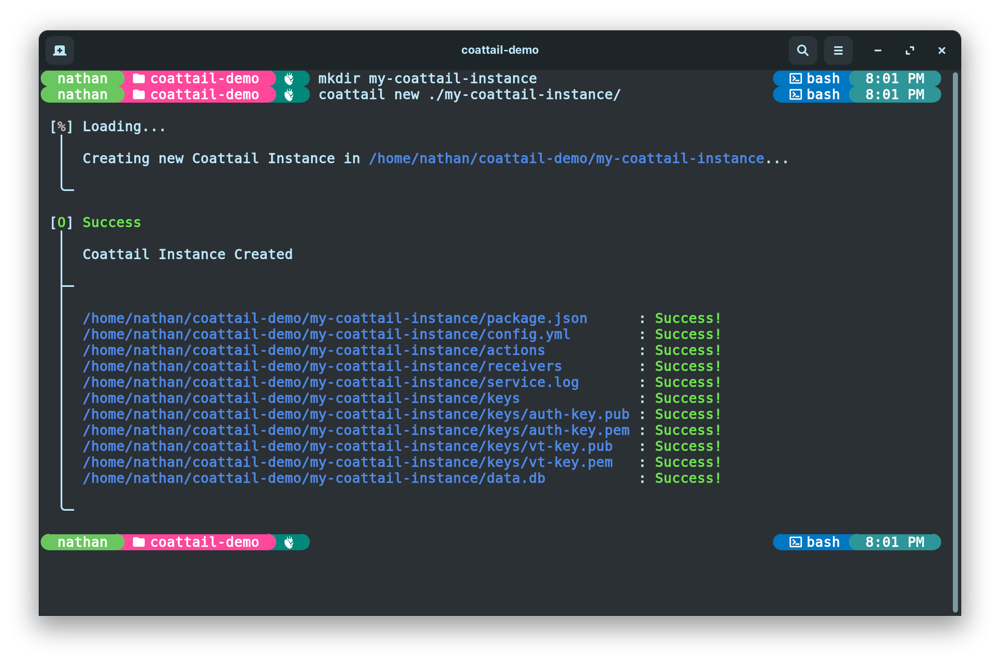
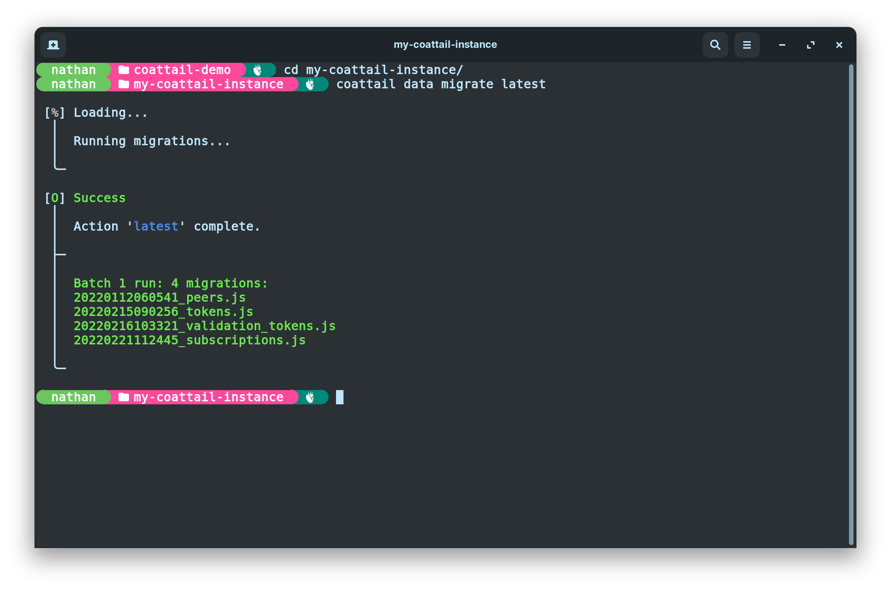
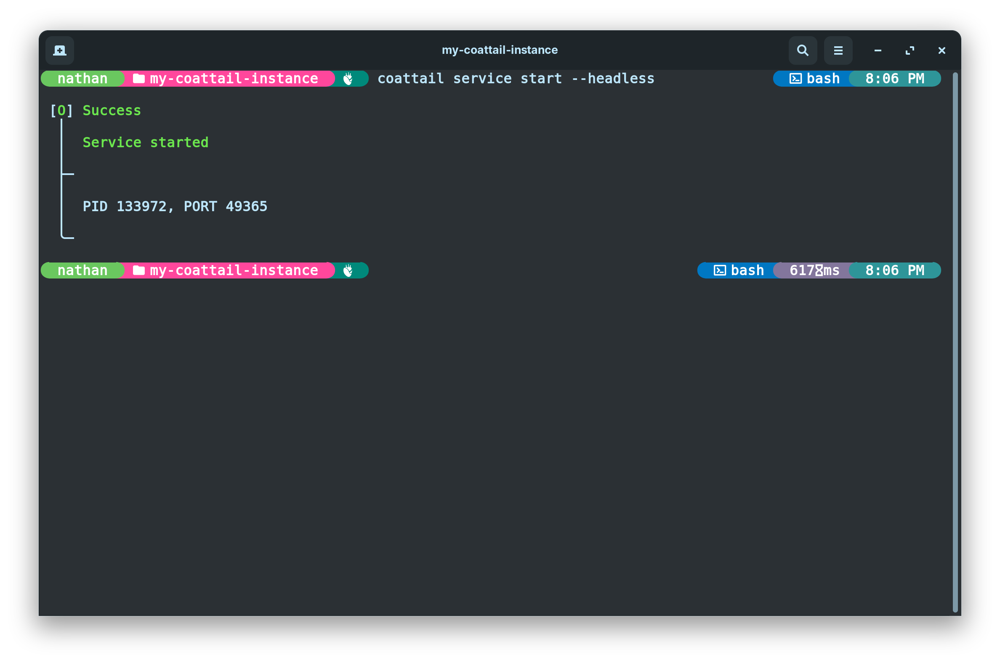
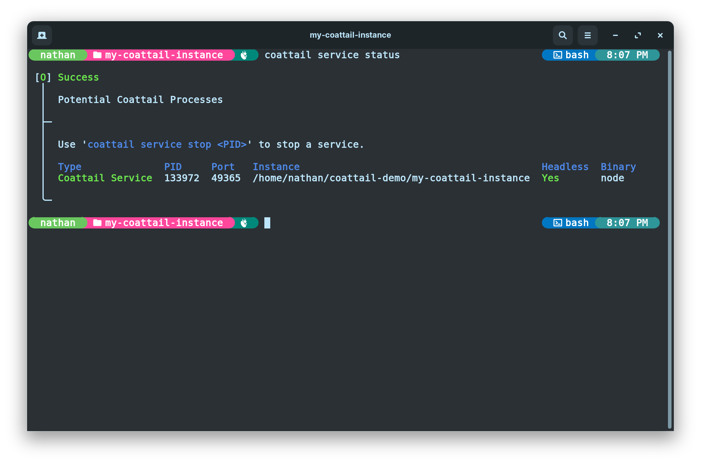

<p align="center">
    
</p>

# Coattail

Coattail is a secure [peer-to-peer](https://en.wikipedia.org/wiki/Peer-to-peer) remote execution and data publication service. It's intention is to provide a generic publication mechanism in which subscribers can utilize the publication data in anyway they see fit by means of implementing receivers in small code modules.

## Index

- [Features](#features)
- [Installing Coattail](#installing-coattail)
- [Getting started](#getting-started)
  - [Initializing a Coattail Instance](#initializing-a-coattail-instance)
  - [Running Database Migrations](#running-database-migrations)
  - [Managing youru Coattail Service](#managing-your-coattail-service)

## Features

|Feature|Documentation|
|---|---|
|Peer-to-peer architecture providing a decentralized base for communication.|[Coattail Architecture](./docs/architecture.md)|
|Easy to use data manipulation, publication and subscription.|[Subscriptions](./docs/architecture.md)|
|Modern command line interface for managing instances.|[CLI Usage](./docs/cli.md)|
|Secure permission driven remote execution on peered instances.|[Tokens](./docs/tokens.md)|
|Subscription based publication chaining.|[Publishing](./docs/publishing.md)|
|Support for secure signature based packet source verification.|[Validation Tokens](./docs/vts.md)|
|Support for TLS providing a secure tunnel with end-to-end encryption for data transport.|[TLS](./docs/tls.md)|

## Installing Coattail

Coattail is primarily a command-line application. You can install Coattail via the [Node Package Manager](https://docs.npmjs.com/downloading-and-installing-node-js-and-npm). Provided you have the Node Pakcage Manager installed, you can run the following command to install Coattail.

```sh
$ npm i -g coattail
```

Once completed, the Coattail command will be available from your CLI. You can verify that the installation was successful by attempting to run the `coattail` command. You should see the following output.


## Getting started

This quick guide will walk you through creating your first Coattail instance and initializing it for first time use. It includes creating the Coattail instance, running it's database Migrations and starting it's core service.

### Initializing a Coattail Instance



> You will need an empty directory in which to store your Coattail Instances files.

```sh
$ mkdir my-coattail-instance
$ coattail new ./my-coattail-instance
```

You should now have the following file structure in your Coattail Instance directory.

```yaml
my-coattail-instance/
├── actions            # Actions that this instance can perform.
├── receivers          # Receivers for incoming publications.
├── keys               # Cryptographic keys
│   ├── auth-key.pem   # Authentication private key.
│   ├── auth-key.pub   # Authentication public key.
│   ├── vt-key.pem     # Validation private key.
│   └── vt-key.pub     # Validation public key.
├── data.db            # Local data storage.
├── package.json       # The npm package file for the Coattail instance.
├── config.yml         # Instance configuration.
└── service.log        # Your service log file.
```

### Running Database Migrations

Once you have created the Coattail Instance, you will need to run Database Migrations to set up the Coattail Instances database for first time use. This database is used to store information about registered peers, issued tokens, subscriptions and other types of persistent data used by the Coattail instance.



### Managing your Coattail service

Your Coattail Instance will need to be running in order for other peers to subscribe to it. You should ideally run your Coattail Instance in headless mode to keep it running in the background.



You can check the status of your Coattial Service by running the following command:


