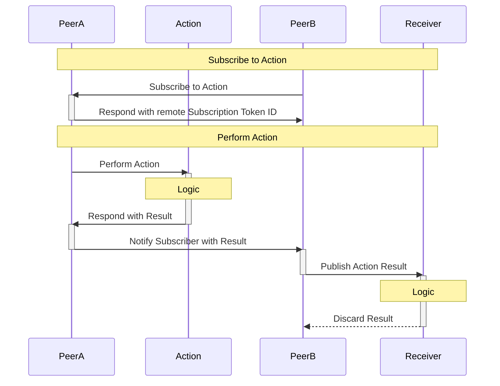

<p align="center">
    
</p>

Coattail is a secure [peer-to-peer](https://en.wikipedia.org/wiki/Peer-to-peer) remote execution and queueless* [pub/sub](https://en.wikipedia.org/wiki/Publish%E2%80%93subscribe_pattern) service. It's intention is to provide a generic publication mechanism in which subscribers can utilize the publication data in anyway they see fit.

## Installation

```sh
$ npm i -g coattail
```

## Features

|Feature|Documentation|
|---|---|
|Peer-to-peer architecture providing a decentralized base for communication.|[Coattail Architecture](./docs/architecture.md)|
|Easy to use data manipulation, publication and subscription.|[Subscriptions](./docs/architecture.md)|
|Modern command line interface for managing instances.|[CLI Usage](./docs/cli.md)|
|Secure permission driven remote publication triggering on peered instances.|[Tokens](./docs/tokens.md)|
|Subscription based publication chaining.|[Publishing](./docs/publishing.md)|
|Support for secure signature based packet source verification.|[Validation Tokens](./docs/vts.md)|
|Support for TLS providing a secure tunnel with end-to-end encryption for data transport.|[TLS](./docs/tls.md)|

## General Use Case



**On PeerA**
```sh
# Create the action that will be used later.
$ coattail action create 'first-action'

# Start the service. Service must be running for other Coattail
# instances to add this instance as a Peer.
$ coattail service start --headless

# Issue a new token. Token will be copied to the clipboard.
$ coattail token issue
```

**On PeerB**
```sh
# Create the receiver that will be used for handling
# incoming publications.
$ coattail action create 'first-action-receiver'

# Start the service, allowing PeerA to communicate freely
# with this Coattail instance.
$ coattail service start --headless

# Add PeerA as a Peer. Will return a Peer ID.
$ coattail peer add <token>

# Subscribe to a remote action named 'first-action' and
# register the local action 'first-action-receiver' as a
# receiver for publications initiated by the remote action.
$ coattail action subscribe \
                  --peer <peer-id> \
                  --action 'first-action' \
                  --receiver 'first-action-receiver'
```

**On PeerA**
```sh
# Perform the action 'first-action' with the specified
# input data and publish the results of the action
# execution to it's subscribers.
$ coattail action perform \
                  --action 'first-action' \
                  --data '{"message":"Hello, world!"}' \
                  --publish-results

# Alternately, you can publish results directly to subscribers
# without executing the action. This will not execute the logic
# in the 'first-action', but will instead send the data directly
# to subscribers.
$ coattail action publish \
                  --action 'first-action' \
                  --data '{"message:"Hello, world!"}'

# At this point, PeerB should receive the action and trigger
# 'first-action-receiver'.
```

_* Coattail does not make use of a queue when publishing events to subscribers._
