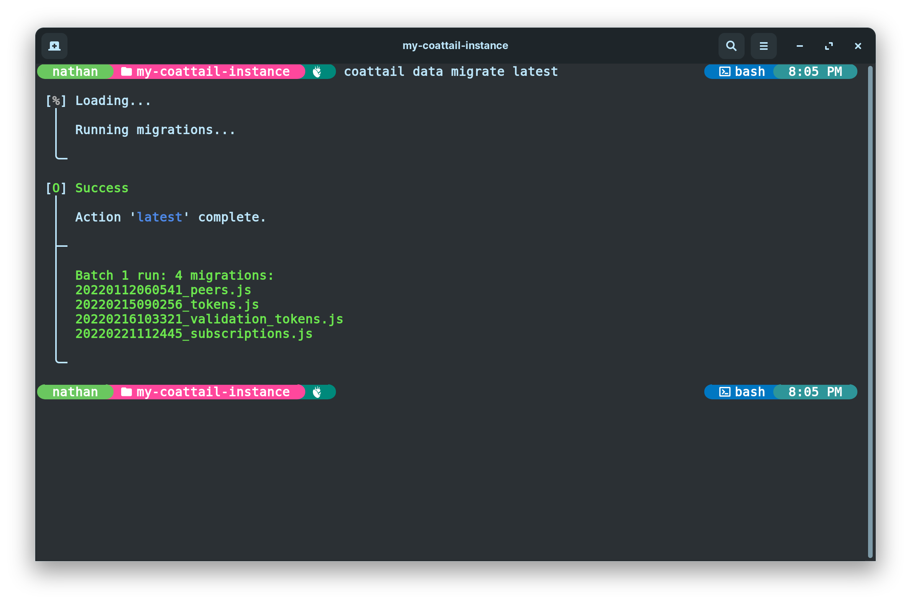

<p align="center">
    
</p>

# Coattail

Coattail is a secure [peer-to-peer](https://en.wikipedia.org/wiki/Peer-to-peer) remote execution and queueless [pub/sub](https://en.wikipedia.org/wiki/Publish%E2%80%93subscribe_pattern) service. It's intention is to provide a generic publication mechanism in which subscribers can utilize the publication data in anyway they see fit.

## Installation

```sh
$ npm i -g coattail
```

## Features

|Feature|Documentation|
|---|---|
|Peer-to-peer architecture providing a decentralized base for communication.|[Coattail Architecture](./docs/architecture.md)|
|Easy to use data manipulation, publication and subscription.|[Subscriptions](./docs/architecture.md)|
|Modern command line interface for managing instances.|[CLI Usage](./docs/cli.md)|
|Secure permission driven remote execution on peered instances.|[Tokens](./docs/tokens.md)|
|Subscription based publication chaining.|[Publishing](./docs/publishing.md)|
|Support for secure signature based packet source verification.|[Validation Tokens](./docs/vts.md)|
|Support for TLS providing a secure tunnel with end-to-end encryption for data transport.|[TLS](./docs/tls.md)|

## Getting Started

### Installing Coattail

You will first need to install Coattail. Provided you already have [Node.js/npm](https://nodejs.org/en/download/) installed, installing Coattail is effortless.

Simply run the following command:
```sh
$ npm i -g coattail
```

### Creating a new Coattail Instance

> You will need an empty directory in which to store your Coattail Instances files.


You should now have the following file structure in your Coattail Instance directory.

- 📂 __.__
   - 📂 __actions__ ─── Actions that this instance can perform.
   - 📂 __receivers__ ─── Receivers for incoming publications.
   - 📂 __keys__ ─── Signing keys.
     - 🔑 auth\-key.pem ─── Authentication private key.
     - 🔑 auth\-key.pub ─── Authentication public key.
     - 🔑 vt\-key.pem ─── Validation private key.
     - 🔑 vt\-key.pub ─── Validation public key.
   - 📄 config.yml ─── Instance configuration.
   - 🗃️ data.db ─── Local data storage.
   - 📄 service.log ─── Your service log file.
   - 📄 package.json ─── The package file for the Coattail instance.

### Running Database Migrations

Once you have created the Coattail Instance, you will need to run Database Migrations to set up the Coattail Instances database for first time use.



### Starting your Coattail Service

Your Coattail Instance will need to be running in order for other peers to subscribe to it. You should ideally run your Coattail Instance in headless mode to keep it running in the background.


You can check the status of your Coattial Service by running the following command:


