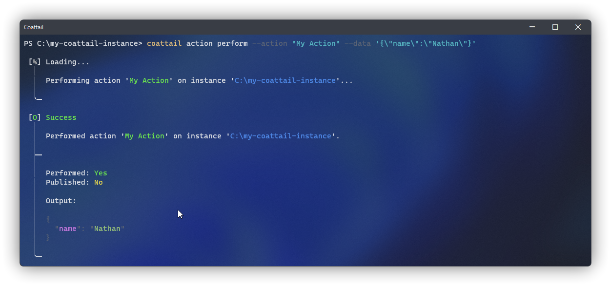
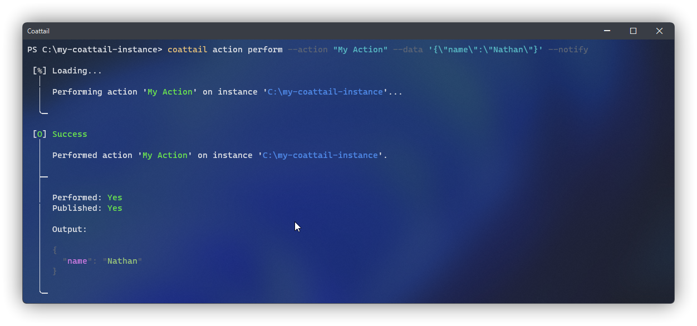

# Managing Actions & Receivers

The basic purpose of Coattail revolves around Actions and Receivers. An action is a small module of code that can be executed on the instance. Once completed, the results of this action can optionally be published to registered subscribers. When published, other Coattail instances that have subscribed to the particular Action on this instance will be notified of the resulting data. When notified, these subscriptions are processed by Receivers.


## Actions

An action is a small module of code that can be executed on the instance. Once completed, the results of this action can optionally be published to registered subscribers.

### Creating an Action

The following command will create a new action on your Coattail instance. This should be run from the root directory of your Coattail instance. Alternately, if you wish to create an action for a particular Coattail instance on your system, you can pass the absolute path of the Coattail Instance to the `--instance` flag. Once you have run this command, a new file will be created in the `actions` directory of your Coattail instance.


The default behavior for this newly created action will be to simply return whatever input it has received as it's output. You can of course customize this behavior to tailor the action to whatever you'd like it to perform. However, if you intend to allow your action to be remotely executed, it is important that you perform thorough validation of the input data.

```ps
$ coattail action create --name "My Action"
```

```js
/* ./actions/My Action.js */

module.exports = (Coattail) => class extends Coattail.Action {
    async perform(input) {
        // Perform action and return output.
        return { ...input };
    }
};
```

### Performing an Action

You can perform this action locally by running the following command. The action should simply return the input data as the output for the action.



```ps
$ coattail action perform --action "My Action" --data '{"name":"Nathan"}'
```

### Publishing Action Result

Once an action is performed, you can optionally notify any subscribers who are subscribed to this particular action. To do so, add the `--notify` flag to your `perform` command invocation.



```ps
$ coattail action perform --action "My Action" --data '{"name":"Nathan"}' --notify
```

Alternately, you can directly publish data to subscribers of an action without performing the action.

```ps
$ coattail action publish --action "My Action" --data '{"name":"Nathan"}'
```

### Listing available Actions

To list the available actions on your Coattail instance, you can use the following command:

```ps
$ coattail action list
```

## Receivers

When an action is published, other Coattail instances that have subscribed to that particular Action on this instance will be notified of the resulting data. When notified, these subscriptions are processed on the subscribing Coattail instance by Receivers.

### Creating a Receiver

The following command will create a new receiver on your Coattail instance. This should be run from the root directory of your Coattail instance. Alternately, if you wish to create a receiver for a particular Coattail instance on your system, you can pass the absolute path of the Coattail Instance to the `--instance` flag. Once you have run this command, a new file will be created in the `receivers` directory of your Coattail instance.


The default behavior for this newly created receiver will be a no-op. You should customize this behavior to appropriately handle the incoming data published by the action.

```ps
$ coattail action create --name "My Receiver" --receiver
```

```js
/* ./receivers/My Receiver.js */

module.exports = (Coattail) => class extends Coattail.Receiver {
    async onReceived(input) {
        // Handle input
    }
};
```

### Listing available Receivers

To list the available receivers on your Coattail instance, you can use the following command:

```ps
$ coattail action list --receivers
```

## Subscription

A Coattail instance can subscribe to an action performed on a remote Coattail instance, registering a particular Receiver to handle publications from that action. To learn more about subscription, see [the Subscription documentation](./subscription.md).