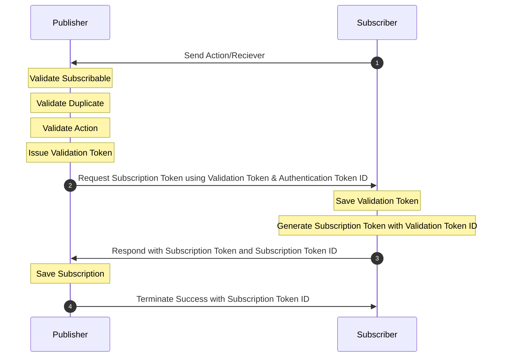

# Subscription Process

## Simplified

```mermaid
sequenceDiagram
    autonumber

    participant Publisher
    participant Subscriber

    Subscriber ->> Publisher: Send Action/Reciever
    Note over Publisher: Validate Subscribable
    Note over Publisher: Validate Duplicate
    Note over Publisher: Validate Action
    Note over Publisher: Issue Validation Token
    Publisher ->> Subscriber: Request Subscription Token using Validation Token & Authentication Token ID
    Note over Subscriber: Save Validation Token
    Note over Subscriber: Generate Subscription Token with Validation Token ID
    Subscriber ->> Publisher: Respond with Subscription Token and Subscription Token ID
    Note over Publisher: Save Subscription
    Publisher ->> Subscriber: Terminate Success with Subscription Token ID
```