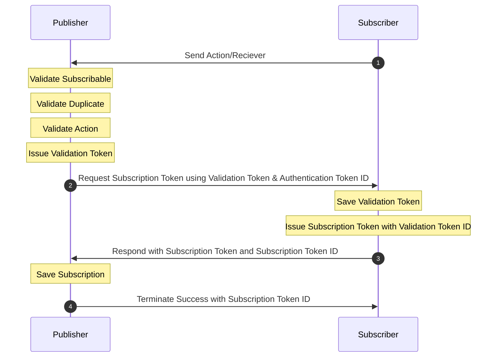
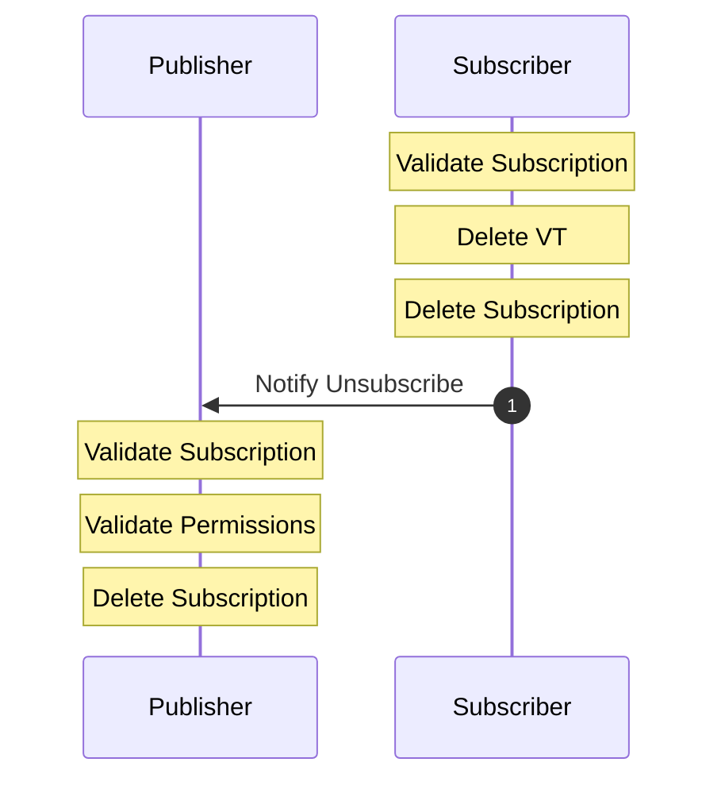
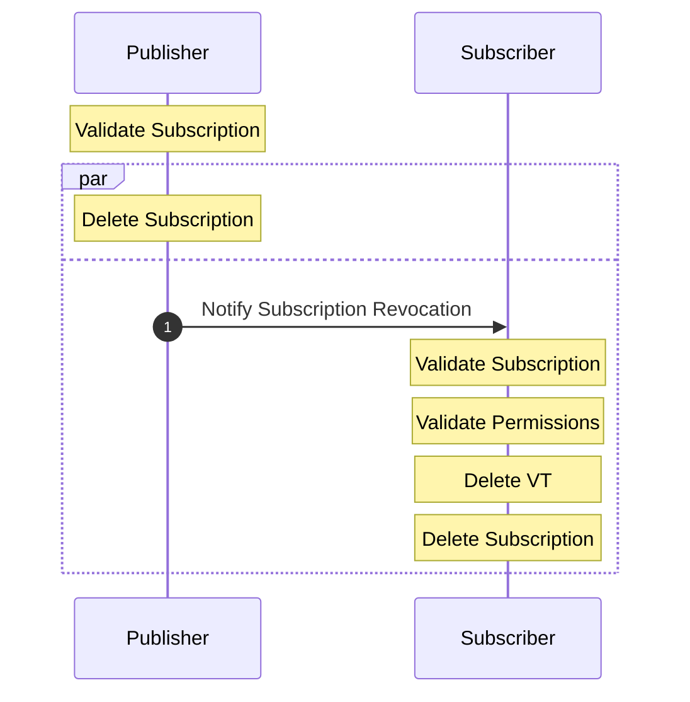

# Subscription Process

## Subscribing

```mermaid
sequenceDiagram
    autonumber

    participant Publisher
    participant Subscriber

    Subscriber ->> Publisher: Send Action/Reciever
    Note over Publisher: Validate Subscribable
    Note over Publisher: Validate Duplicate
    Note over Publisher: Validate Action
    Note over Publisher: Issue Validation Token
    Publisher ->> Subscriber: Request Subscription Token using Validation Token & Authentication Token ID
    Note over Subscriber: Save Validation Token
    Note over Subscriber: Issue Subscription Token with Validation Token ID
    Subscriber ->> Publisher: Respond with Subscription Token and Subscription Token ID
    Note over Publisher: Save Subscription
    Publisher ->> Subscriber: Terminate Success with Subscription Token ID
```

## Unsubscribing

### From Subscriber

```mermaid
sequenceDiagram
    autonumber

    participant Publisher
    participant Subscriber

    Note over Subscriber: Validate Subscription
    Note over Subscriber: Delete VT
    Note over Subscriber: Delete Subscription

    Subscriber ->> Publisher: Notify Unsubscribe

    Note over Publisher: Validate Subscription
    Note over Publisher: Validate Permissions
    Note over Publisher: Delete Subscription
```

### From Publisher

```mermaid
sequenceDiagram
    autonumber

    participant Publisher
    participant Subscriber

    Note over Publisher: Validate Subscription

    par
        Note over Publisher: Delete Subscription
    and
        Publisher ->> Subscriber: Notify Subscription Revocation
        Note over Subscriber: Validate Subscription
        Note over Subscriber: Validate Permissions
        Note over Subscriber: Delete VT
        Note over Subscriber: Delete Subscription
    end
```